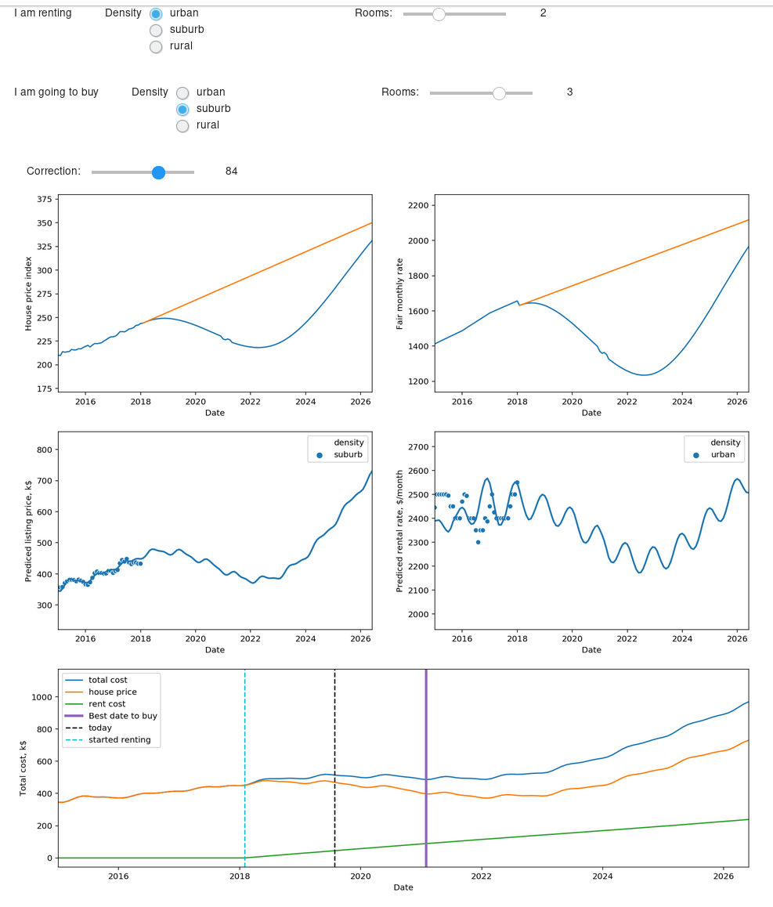

* Rent or Buy

Here I use regression analysis on real-estate market to determine the optimal
time of buying a house in a case of coming recession. As a historical data on
house prices I use a data set from
[Zillow](https://www.kaggle.com/zillow/zecon), which provides monthly median
listing prices and rental rates for units of different sizes and locations in
the period from 2011 till 2018. However, this period does not include the period
of recession when house prices where falling rapidly. 

To capture the period of the house bubble bust, I use some historical government
data: house price index
([HPI](https://www.fhfa.gov/DataTools/Downloads/Pages/House-Price-Index.aspx))
and Fair monthly rate ([FMR](https://www.huduser.gov/portal/datasets/fmr.html)).
The HPI represents an aggregated index house prices in a regions, while the FMR
provides an aggregated data for rental rates across cities and counties.

The idea of my approach, is to use the government indexes as predictors for
listing prices and rental rates in a particular local market. By a local market
I consider houses having a particular number of bedrooms and located in an
urban, suburb or rural population density area. As an example, I provide
analysis for Eastern Massachusetts, where I currently reside.

The central result of this work is an interactive dashboard in which one can bet
an estimate of the house market drop, select which type of house one is
currently renting and which type one wants to buy. The app calculates an
estimated cost the purchase, considering the future paid rent and the house
listing price. 

To run an interactive notebook click below:

DISCLAIMER:

THIS PROGRAM IS NOT DESIGNED TO GIVE ANY FINANCIAL ADVICE. TO INVEST ON THE
REAL-ESTATE MARKET CONTACT A QUALIFIED REALTOR. I AM NOT RESPONSIBLE FOR ANY
FINANCIAL LOSS OR LOSS OF PROFIT SHOULD YOU DECIDE TO USE THIS PROGRAM.

    rent-or-buy Copyright (C) 2019  Ivan Lisenkov
    This program comes with ABSOLUTELY NO WARRANTY;
    This is free software, and you are welcome to redistribute it
    under certain conditions;